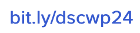

#### Orario delle lezioni

| Giorno          | Aula |
| :-------------: |      |
| Martedì 11-14   |  D32  |
| Giovedì 18-20   |  D43  |

#### Comunicazioni
{: #tag}

Durante il corso si utilizzerà **Discord** come per il supporto agli studenti e **per gli avvisi**.
È possibile accedere al corso attraverso [questo link](https://discord.gg/4cyBSJxkqb).

<!---->

#### Esami

L'esame consiste nella presentazione e discussione di un sito web realizzato come progetto di fine corso.

Gli studenti che **frequentano** il corso possono svolgere una serie di *homework* finalizzati ad affrontare di volta in volta aspetti specifici della progettazione del sito web,
seguendo un processo graduale verso la realizzazione del progetto da discutere all'esame. La consegna dell'homework sarà effettuata attraverso GitHub, secondo tempistiche prestabilite.
La modalità di superamento dell'esame tramite homework può essere sfruttata entro la seconda sessione di esami dell'anno accademico.

In alternativa, è possibile realizzare un *progetto unico*, secondo le specifiche disponibili a questo
[link](https://studentiunict-my.sharepoint.com/:b:/g/personal/simone_palazzo_unict_it/ETJoInIWX_JNiA6P2ek4GYoBRQ5kobsyKxFnVqJb1vK3mA?e=f0xJQ6).

**Regole sullo svolgimento del progetto**
* Non è permesso usare LLM (es. ChatGPT)
* Il codice presentato all'esame non deve essere commentato **in alcun modo**
* Devono essere utilizzate **esclusivamente** le funzionalità viste a lezione

**Prenotazione esame**
* [Link di prenotazione](https://forms.gle/XF6gskfBbNuQLy3j8)
* [Calendario dei turni](https://studentiunict-my.sharepoint.com/:x:/g/personal/simone_palazzo_unict_it/EQZrnwAlgvdJrKkogcCK4ncBSNpjyIzDCSilLdVKN4yf2Q?e=TLMyqb)

<!-- [A questo link](https://calendly.com/simone-palazzo/esami-wp) è possibile prenotarsi per l'esame (sia homework che progetto unico). -->

#### Contatti e ricevimento

- [Simone Palazzo](mailto:simone.palazzo@unict.it)
- [Matteo Pennisi](mailto:matteo.pennisi@phd.unict.it)
- [Raffaele Mineo](mailto:raffaele.mineo@phd.unict.it)

Gli orari di ricevimento sono i seguenti:
- martedì, dalle 12:00 alle 13:00
- mercoledì, dalle 12:00 alle 13:00

I ricevimenti possono essere tenuti di presenza, presso il Polo Tecnologico, Lab. Mednetna, o online.
È consigliabile contattare i docenti via e-mail prima di presentarsi al ricevimento, per ogni evenienza.